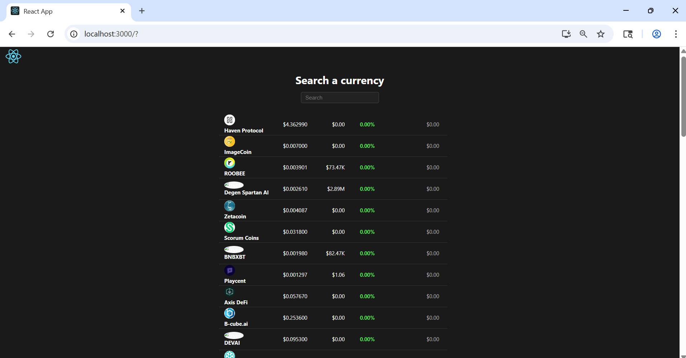

# Crypto Dashboard

An interactive dashboard to explore and track cryptocurrency data in real time.

## Overview

Crypto Dashboard is a React-based web application that allows users to search, filter, and view detailed information about various cryptocurrencies. It fetches live data from a public crypto API and displays key metrics such as price, volume, market cap, and daily change.

## Features

- Live cryptocurrency data (price, volume, market cap, daily change)
- Search and filter coins by name or symbol
- Responsive and modern UI
- Color-coded price change indicators
- Clean, readable formatting for large numbers

## Screenshots



_Sample view of the dashboard UI_

## Getting Started

### Prerequisites

- Node.js (v14 or higher recommended)
- npm

### Installation

1. Clone the repository:
	```bash
	git clone https://github.com/yourusername/crypto-dashboard.git
	cd crypto-dashboard
	```
2. Install dependencies:
	```bash
	npm install
	```
3. Start the development server:
	```bash
	npm start
	```
4. Once the server is running, open your browser and go to http://localhost:3000 to view the app locally.

> **Note:** The above link only works when running the app on your own computer. If you want others to view your project online, you need to deploy it to a hosting service (e.g., Vercel, Netlify, GitHub Pages) and share the deployed URL here.

## Usage

- Use the search bar to find cryptocurrencies by name or symbol.
- View real-time price, volume, market cap, and daily change for each coin.
- Green/red highlights indicate positive/negative price changes.

## Tech Stack

- React
- Axios (for API requests)
- CSS (custom styling)

## Folder Structure

```
crypto-dashboard/
├── public/
│   └── index.html
├── src/
│   ├── App.js
│   ├── App.css
│   ├── index.js
│   ├── component/
│   │   ├── coin.jsx
│   │   └── coin.css
│   └── ...
├── package.json
└── README.md
```
